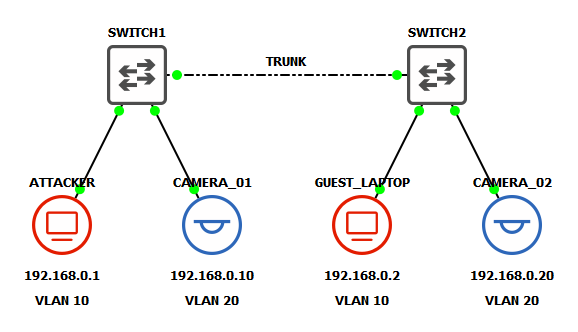

# VLAN Hopping: Switch Spoofing
Switch spoofing is a VLAN hopping technique that abuses Dynamic Trunking Protocol (DTP), a Cisco proprietary protocol used to automatically negotiate trunk links between switches. In this attack, an adversary connects a device to an access port on a switch and configures their interface to actively participate in DTP negotiations. If the switch port is configured to negotiate (which is enabled by default), the attacker's device can spoof itself as a switch by sending forged DTP packets. This can trick the legitimate switch into establishing a trunk link, allowing the attacker to receive traffic from multiple VLANs, including those they shouldn’t have access to. Once a trunk is established, the attacker can craft and analyze 802.1Q-tagged packets, making it possible to launch further attacks or passively eavesdrop on inter-VLAN traffic. This vulnerability can be mitigated by disabling DTP on all client-facing switch ports.

> This lab was inspired by *Practical IoT Hacking* (O'Reilly), Chapter 4: **Network Assessments**, Section *"Hopping into the IoT Network"*. It assumes basic knowledge of GNS3 and networking.

## Lab Topology

## Initial Setup
### Switch Port Layout
| Switch  | Port  | Connected Device | VLAN    | Port Mode       |
|---------|-------|------------------|---------|-----------------|
| SWITCH1 | Fa0/0 | SWITCH2          | N/A     | Trunk (Dynamic) |
| SWITCH1 | Fa0/1 | ATTACKER         | VLAN 20 | Access          |
| SWITCH1 | Fa0/2 | CAMERA_01        | VLAN 10 | Access          |
| SWITCH2 | Fa0/0 | SWITCH1          | N/A     | Trunk (Dynamic) |
| SWITCH2 | Fa0/1 | GUEST_LAPTOP     | VLAN 20 | Access          |
| SWITCH2 | Fa0/2 | CAMERA_02        | VLAN 10 | Access          |

### Enabling telnet on Cisco switch
Configure management IP
<pre>
  Switch> enable
  Switch# configure terminal
  Switch(config)# interface vlan1
  Switch(config-if)# ip address [ip_address] [subnet]
  Switch(config-if)# no shutdown
  Switch(config-if)# exit
</pre>

Enable remote management
<pre>
  Switch# configure terminal
  Switch(config)# line vty 0 4
  Switch(config-line)# no login
  Switch(config-line)# transport input telnet
  Switch(config-line)# exit
  Switch(config)# enable password [passowrd]
  Switch(config)# exit
</pre>

## Verify Connectivity

## IOS VLAN Configuration

## Verify Subnet Segmentation

## Exploit

## Mitigations
