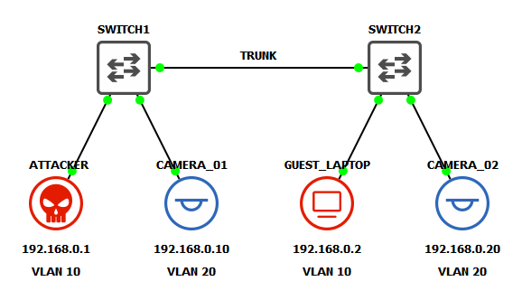

# VLAN Hopping: Switch Spoofing
Switch spoofing is a VLAN hopping technique that abuses Dynamic Trunking Protocol (DTP), a Cisco proprietary protocol used to automatically negotiate trunk links between switches. In this attack, an adversary connects a device to an access port on a switch and configures their interface to actively participate in DTP negotiations. If the switch port is configured to negotiate (which is enabled by default), the attacker's device can spoof itself as a switch by sending forged DTP packets. This can trick the legitimate switch into establishing a trunk link, allowing the attacker to receive traffic from multiple VLANs, including those they shouldn’t have access to. Once a trunk is established, the attacker can craft and analyze 802.1Q-tagged packets, making it possible to launch further attacks or passively eavesdrop on inter-VLAN traffic. This vulnerability can be mitigated by disabling DTP on all client-facing switch ports.

> This lab was inspired by *Practical IoT Hacking* (O'Reilly), Chapter 4: **Network Assessments**, Section *"Hopping into the IoT Network"*. It assumes basic knowledge of GNS3 and networking.

## Lab Topology


## Initial Setup
### Switch Port Layout
| Switch  | Port  | Connected Device | VLAN    | Port Mode       |
|---------|-------|------------------|---------|-----------------|
| SWITCH1 | Et0/0 | SWITCH2          | N/A     | Trunk (Dynamic) |
| SWITCH1 | Et0/1 | ATTACKER         | VLAN 10 | Access          |
| SWITCH1 | Et0/2 | CAMERA_01        | VLAN 20 | Access          |
| SWITCH2 | Et0/0 | SWITCH1          | N/A     | Trunk (Dynamic) |
| SWITCH2 | Et0/1 | GUEST_LAPTOP     | VLAN 10 | Access          |
| SWITCH2 | Et0/2 | CAMERA_02        | VLAN 20 | Access          |

### VPCS Static IPv4 Configuration
To keep the lab simple, both **CAMERA_01**, **CAMERA_02**, and **GUEST_LAPTOP** are implemented using [VPCS](https://docs.gns3.com/docs/emulators/vpcs/) (Virtual PC Simulator) appliances. This provides a lightweight way to simulate basic IoT device connectivity within the network. The following commands assign an IP address and saves it across reboots.
<pre>
  VPCS> ip 192.168.0.x/24
  VPCS> save
</pre>

### Kali Static IPv4 Configuration
The **ATTACKER** machine is a Kali linux VM running the default [VirtualBox image](https://www.kali.org/get-kali/#kali-virtual-machines). This gives us access to most of the tools needed for these labs and will be reused in the future. Below shows the steps for configuring static IP addresses using CLI:
> Note: The shortcut for spawning a terminal in linux is `CTL+ALT+T`

Remove any existing configs
```
ip address flush dev eth0
```
Set static IPv4 address
```
ip address add 192.168.0.1/24 dev eth0
```
Verify
```
ip --color --family inet address show
```
><pre>
>  1: lo: <LOOPBACK,UP,LOWER_UP> mtu 65536 qdisc noqueue state UNKNOWN group default qlen 1000
>    inet 127.0.0.1/8 scope host lo
>       valid_lft forever preferred_lft forever
>  2: eth0: <BROADCAST,MULTICAST,UP,LOWER_UP> mtu 1500 qdisc fq_codel state UP group default qlen 1000
>    inet 192.168.0.1/24 scope global eth0
>       valid_lft forever preferred_lft forever
></pre>

```
apt update && apt -y install yersinia iproute2 inetutils-ping kmod vlan
apt install linux-modules-$(uname -r)
```

### Cisco IOS
**SWITCH1** and **SWITCH2** are virtual Cisco IOS Layer 2 devices. You can use either the IOSvL2 or IOU L2 GNS3 appliance templates for this lab. They should work as standard switches 'out of the box', no configurations necessary. Note that since these are virtualized appliances, they may not behave exactly like their hardware counterparts.

## IOS VLAN Configuration
Create two new VLANs: one for the workstations (10) and another for the 'IoT' devices (20). I named them RED and BLUE respectivly to match the topology diagram.
<pre>
  SWITCH1> enable
  SWITCH1# configure terminal
  SWITCH1(config)# vlan 10
  SWITCH1(config-vlan)# name RED
  SWITCH1(config-vlan)# exit
  SWITCH1(config)# vlan 20
  SWITCH1(config-vlan)# name BLUE
  SWITCH1(config-vlan)# CTRL+Z
  SWITCH1# show vlan brief

  VLAN Name                             Status    Ports
  ---- -------------------------------- --------- -------------------------------
  1    default                          active    Et0/0, Et0/1, Et0/2, Et0/3
                                                  Et1/0, Et1/1, Et1/2, Et1/3
                                                  Et2/0, Et2/1, Et2/2, Et2/3
                                                  Et3/0, Et3/1, Et3/2, Et3/3
  10   RED                              active
  20   BLUE                             active
</pre>

Assign RED to switchport Et0/1 (ATTACKER) and BLUE to Et0/2 (CAMERA_01).
<pre>
  SWITCH1# configure terminal
  SWITCH1(config)# interface Et0/1
  SWITCH1(config-if)# switchport mode access
  SWITCH1(config-if)# switchport access vlan 10
  SWITCH1(config-if)# exit
  SWITCH1(config)# interface Et0/2
  SWITCH1(config-if)# switchport mode access
  SWITCH1(config-if)# switchport access vlan 20
  SWITCH1(config-if)# CTRL+Z
  SWITCH1# show vlan brief
  
  VLAN Name                             Status    Ports
  ---- -------------------------------- --------- -------------------------------
  1    default                          active    Et0/0, Et0/3, Et1/0, Et1/1
                                                  Et1/2, Et1/3, Et2/0, Et2/1
                                                  Et2/2, Et2/3, Et3/0, Et3/1
                                                  Et3/2, Et3/3
  10   RED                              active    Et0/1
  20   BLUE                             active    Et0/2
</pre>

Repeat these step on SWITCH2 to assign GUEST_LAPTOP to VLAN 10 and CAMERA_02 to VLAN 20.

Try to ping CAMERA_02 from CAMERA_02.


### DTP Configuration

By default, Cisco switches are set to dynamically build trunk links when DTP packets are seen on the wire.

## Verify Subnet Segmentation

## Exploit
### Configuring VLAN Interfaces in Linux
<pre>
  apt install vlan
  modprobe 8021q
  lsmod | grep 8021q
  ip link add link eth0 name eth0.10 type vlan id 10
  ip link add link eth0 name eth0.20 type vlan id 20
  ip address add 192.168.0.1/24 dev eth0.10
  ip address add 192.168.0.1/24 dev eth0.20
  ip link set dev eth0.10 up
  ip link set dev eth0.20 up
</pre>

## Mitigations
