# VLAN Hopping: Double Tagging
Double tagging is a Layer 2 network attack technique that exploits the behavior of 802.1Q trunk ports and native VLAN handling on switches. In this attack, a threat actor crafts Ethernet frames with two VLAN tags: an outer tag that matches the native VLAN (commonly VLAN 1) and an inner tag for the target VLAN they wish to access. When the packet is sent from an access port belonging to the native VLAN, the first switch removes the outer tag and forwards the frame onto the trunk. The second switch, upon receiving the now-single-tagged frame, interprets the remaining inner tag and forwards it to the corresponding VLAN. This allows the attacker to send traffic into VLANs they shouldn't have access to, even though their physical port is not assigned to that VLAN. Double tagging is difficult to detect because return traffic typically can't follow the same path back, making it a one-way attack. This is useful for injecting packets into restricted VLANs.

> This lab was inspired by *Practical IoT Hacking* (O'Reilly), Chapter 4: **Network Assessments**, Section *"Hopping into the IoT Network"*. It assumes basic knowledge of GNS3 and networking.

## Lab Topology
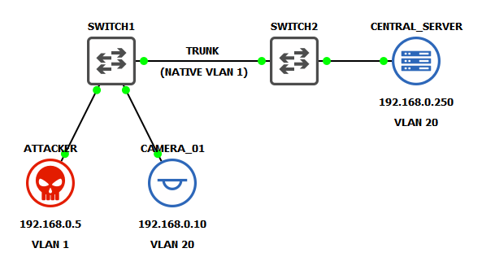

## Initial Setup
### Switch Port Layout
| Switch   | Port    | Connected Device | VLAN    | Port Mode             |
|----------|---------|------------------|---------|-----------------------|
| SWITCH1  | Et0/0   | SWITCH2          | N/A     | Trunk (native VLAN 1) |
| SWITCH1  | Et0/1   | CAMERA_01        | VLAN 20 | Access                |
| SWITCH1  | Et0/2   | ATTACKER         | VLAN 1  | Access                |
| SWITCH2  | Et0/0   | SWITCH1          | N/A     | Trunk (native VLAN 1) |
| SWITCH2  | Et0/1   | CENTRAL_SERVER   | VLAN 20 | Access                |

### VPCS Static IPv4 Configuration
To keep the lab simple, both **CAMERA_01** and **CENTRAL_SERVER** are implemented using [VPCS](https://docs.gns3.com/docs/emulators/vpcs/) (Virtual PC Simulator) appliances. This provides a lightweight way to simulate basic IoT device connectivity within the network. The following command assigns an IP address and saves it across reboots.
<pre>
  VPCS> ip 192.168.0.x/24
  VPCS> save
</pre>

### Docker Container IPv4 Configuration
The **ATTACKER** machine is a Docker container. The imaged used in this lab is [finchsec/scapy](https://hub.docker.com/r/finchsec/scapy), which gives access to the Scapy program for crafting custom network packets to perform this attack. Configuring IP addresses for Docker appliances in GNS3 is easy as shown below:

**Right-click**, then select `Edit Config` from the context menu.

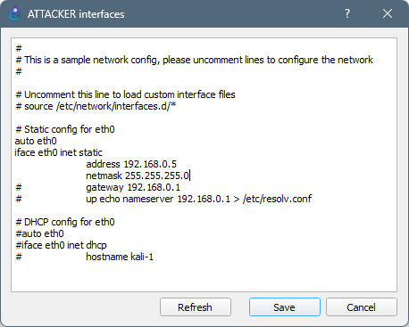

### Cisco IOS
**SWITCH1** and **SWITCH2** are virtual Cisco IOS Layer 2 devices. You can use either the IOSvL2 or IOU L2 GNS3 appliance templates for this lab. They should work as standard switches 'out of the box', no configurations necessary. Note that since these are virtualized appliances, they may not behave exactly like their hardware counterparts.

## Verify Connectivity
CAMERA_01 should be able to ping CENTRAL_SERVER.

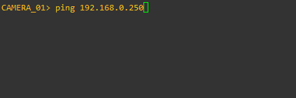

ATTACKER should be able to ping both CAMERA_01 and CENTRAL_SERVER.
<pre>
  >>> packet = IP(dst='192.168.0.x')/ICMP()
  >>> sr1(packet).show()
</pre>
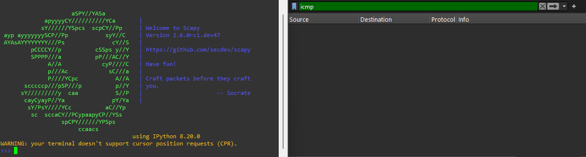

## IOS VLAN Configuration
Create a new VLAN for the IoT devices with an ID of 20. I named it BLUE to match the network topology diagram.
<pre>
  SWITCH1> enable
  SWITCH1# configure terminal
  SWITCH1(config)# vlan 20
  SWITCH1(config-vlan)# name BLUE
  SWITCH1(config-vlan)# exit
  SWITCH1# show vlan brief
  
  VLAN Name                             Status    Ports
  ---- -------------------------------- --------- -------------------------------
  1    default                          active    Et0/0, Et0/1, Et0/2, Et0/3
                                                  Et1/0, Et1/1, Et1/2, Et1/3
                                                  Et2/0, Et2/1, Et2/2, Et2/3
                                                  Et3/0, Et3/1, Et3/2, Et3/3
  20   BLUE                             active
</pre>

Assign BLUE to switchport Et0/1 (CAMERA_01).
<pre>
  SWITCH1# configure terminal
  SWITCH1(config)# interface Et0/1
  SWITCH1(config-if)# switchport mode access
  SWITCH1(config-if)# switchport access vlan 20
  SWITCH1(config-if)# exit
  SWITCH1# show vlan brief
  
  VLAN Name                             Status    Ports
  ---- -------------------------------- --------- -------------------------------
  1    default                          active    Et0/0, Et0/2, Et0/3, Et1/0
                                                  Et1/1, Et1/2, Et1/3, Et2/0
                                                  Et2/1, Et2/2, Et2/3, Et3/0
                                                  Et3/1, Et3/2, Et3/3
  20   BLUE                             active    Et0/1
</pre>

Configure interface Et0/0 as a static trunk using IEEE 802.1Q encapsulation. This protocol is the industry standard for VLAN tagging.
<pre>
  SWITCH1# configure terminal
  SWITCH1(config)# interface Et0/0
  SWITCH1(config-if)# switchport trunk encapsulation dot1q
  SWITCH1(config-if)# switchport mode trunk
  SWITCH1(config-if)# switchport trunk allowed vlan all
  SWITCH1(config-if)# exit
  SWITCH1# show interfaces trunk

  Port        Mode             Encapsulation  Status        Native vlan
  Et0/0       on               802.1q         trunking      1

  Port        Vlans allowed on trunk
  Et0/0       1-4094

  Port        Vlans allowed and active in management domain
  Et0/0       1,20

  Port        Vlans in spanning tree forwarding state and not pruned
  Et0/0       none
</pre>
> Note how the **Native vlan** value is 1 by default.

Repeat these step on SWITCH2 to assign CENTRAL_SERVER to VLAN 20.

## Verify Subnet Segmentation
Assuming the VLAN was configured correctly, CAMERA_01 should still be able to ping CENTRAL_SERVER...

  

    VLAN Tag Removal Demonstrated...
  

  > Start a Wireshark capture on the link between SWITCH1 and SWITCH2. Then, initiate another ping from CAMERA_01 to CENTRAL_SERVER. In the `Packet Details` pane, observe that the switch inserts a 4-byte 802.1Q VLAN tag immediately after the Ethernet header, indicating the frame originated from a VLAN 20 access port.
  > 
  > 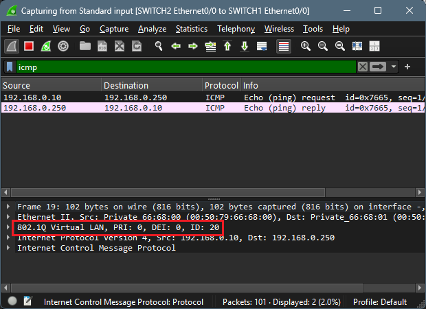
  > 
  > As the packet is forwarded to its destination, SWITCH2 removes the VLAN tag before delivering it to the receiving device.
  >
  > 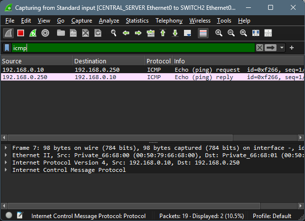

However, ATTACKER should no longer be able to ping CAMERA_01 or CENTRAL_SERVER.
<pre>
  >>> packet = IP(dst='192.168.0.x')/ICMP()
  >>> sr1(packet).show()
</pre>
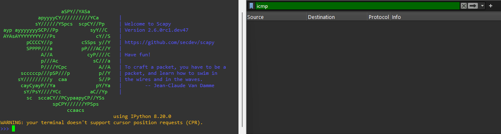

As can be seen, the ICMP echo requests never reach CENTRAL_SERVER.

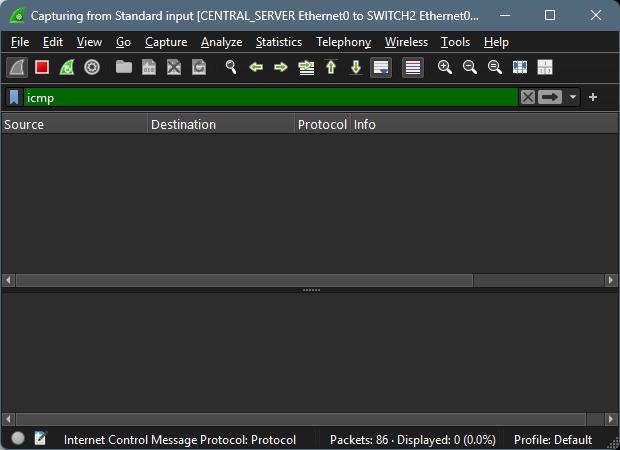

## Exploit
Use Scapy to craft a double-tagged ICMP Echo Request packet. The outer VLAN tag should be set to the native VLAN (`vlan=1`), which will be stripped by the first switch, while the inner tag (`vlan=20`) corresponds to the VLAN of the intended target. This technique allows the packet to traverse VLAN boundaries and reach the destination, bypassing segmentation controls. However, because the attacker remains on the wrong VLAN, ICMP Echo Replies will not be returned, rendering this a one-way communication exploit.

<pre>
  >>> packet = Ether(dst='ff:ff:ff:ff:ff:ff')/Dot1Q(vlan=1)/Dot1Q(vlan=20)/IP(dst='192.168.0.250')/ICMP()
  >>> sendp(packet, iface="eth0")
</pre>
> Note, for further obfuscation, you can also change the source IP address of the packet.
> `IP(src=<ip_address>, dst=<ip_address>)`

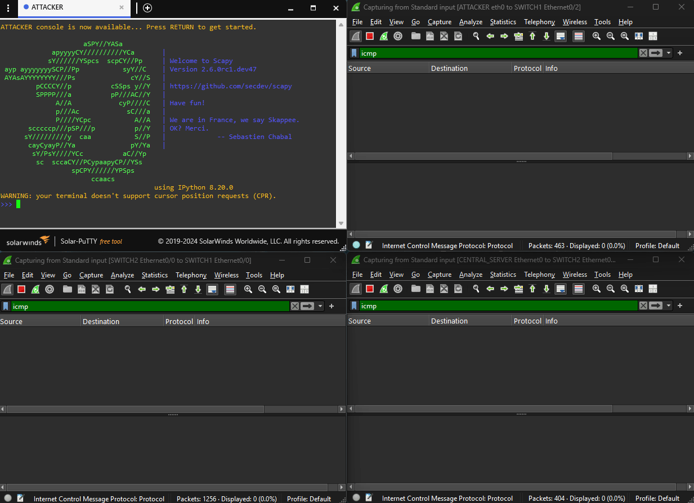

  

    Closer Examination
  

  > Capture between ATTACKER and SWITCH1. The crafted packet has two IEEE 802.1Q tags as it is sent to the switch.
  > 
  > 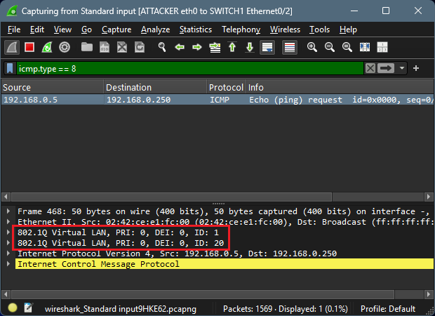
  > 
  > Capture between SWITCH1 and SWITCH2. SWITCH1 strips the outer tag, leaving the second tag to be forwarded to SWITCH2.
  >
  > 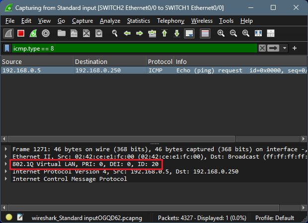
  >
  > Capture between SWITCH2 and CENTRAL_SERVER. The request is forwarded to its target in VLAN 20, where the second tag is also removed.
  >
  > 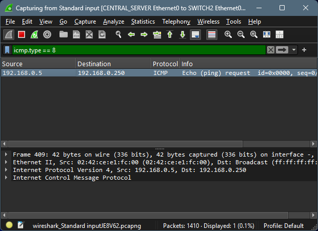
  >
  > Capture between CENTRAL_SERVER and SWITCH2. The target receives the Echo Request, and transmits a reply in response.
  > 
  > 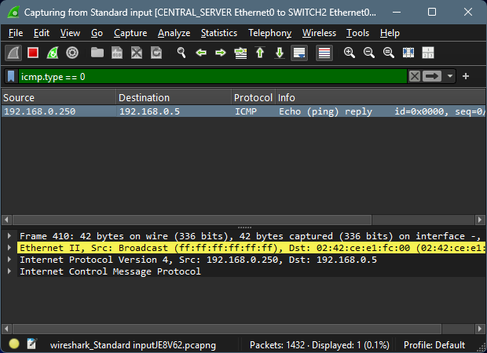
  >
  > Capture between SWITCH2 and SWITCH1. Since the reply came from a VLAN 20 access port, it is tagged before being forwarded to SWITCH1.
  >
  > 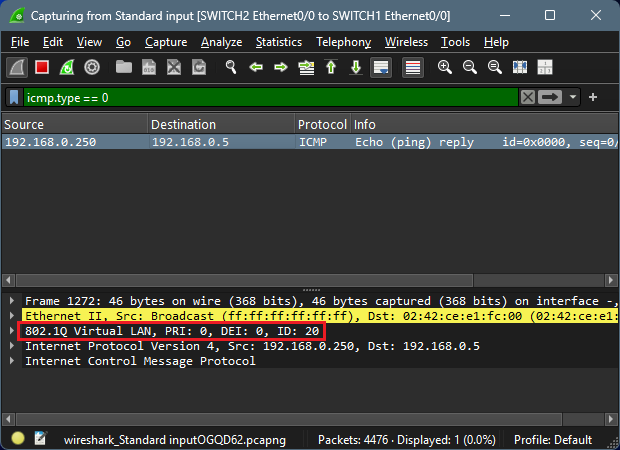
  >
  > Capture betweeen SWITCH1 and ATTACKER. The Echo Reply does not know ATTACKER is in VLAN 1, so it never reaches its destination.
  > 
  > 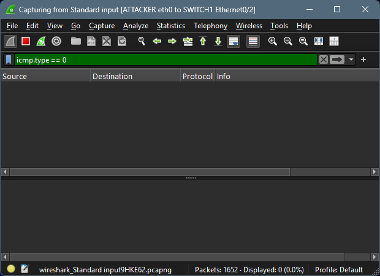

## Mitigations
Double tagging attacks can be mitigated by:
- Setting the native VLAN to an unused VLAN
- Configuring trunks to tag native VLANs (`vlan dot1q tag native`)
- Avoiding VLAN 1 for any user-access ports
- Shutdown any unused ports
