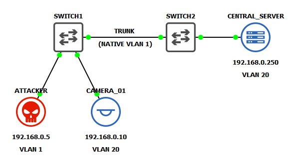

test

## 🖥️ Lab Topology

Create new vlan
<pre>
  SWITCH1> enable
  SWITCH1# configure terminal
  SWITCH1(config)# vlan 20
  SWITCH1(config-vlan)# name BLUE
  SWITCH1(config-vlan)# exit
  SWITCH1# show vlan brief
  
  VLAN Name                             Status    Ports
  ---- -------------------------------- --------- -------------------------------
  1    default                          active    Et0/0, Et0/1, Et0/2, Et0/3
                                                  Et1/0, Et1/1, Et1/2, Et1/3
                                                  Et2/0, Et2/1, Et2/2, Et2/3
                                                  Et3/0, Et3/1, Et3/2, Et3/3
  20   BLUE                             active
</pre>

Assign vlan to switchport Et0/1 (CAMERA_01)
<pre>
  SWITCH1> enable
  SWITCH1# configure terminal
  SWITCH1(config)# interface Et0/1
  SWITCH1(config-if)# switchport mode access
  SWITCH1(config-if)# switchport access vlan 20
  SWITCH1(config-if)# exit
  SWITCH1# show vlan brief
  
  VLAN Name                             Status    Ports
  ---- -------------------------------- --------- -------------------------------
  1    default                          active    Et0/0, Et0/2, Et0/3, Et1/0
                                                  Et1/1, Et1/2, Et1/3, Et2/0
                                                  Et2/1, Et2/2, Et2/3, Et3/0
                                                  Et3/1, Et3/2, Et3/3
  20   BLUE                             active    Et0/1
</pre>

Configure Et0/0 as static trunk port
<pre>
  SWITCH1> enable
  SWITCH1# configure terminal
  SWITCH1(config)# interface Et0/0
  SWITCH1(config-if)# switchport trunk encapsulation dot1q
  SWITCH1(config-if)# switchport mode trunk
  SWITCH1(config-if)# switchport trunk allowed vlan 20
  SWITCH1(config-if)# exit
  SWITCH1# show interfaces trunk
  
  Port           Mode             Encapsulation  Status        Native vlan
  Et0/0          on               802.1q         trunking      1

  Port           Vlans allowed on trunk
  Et0/0          20

  Port           Vlans allowed and active in management domain
  Et0/0          20

  Port           Vlans in spanning tree forwarding state and not pruned
  Et0/0          20
</pre>

Repeat these step on SWITCH2

Both CAMERA_01 and CENTRAL_SERVER are VPCS (virtual PC simulator) appliances. The following command configures IPv4 addreses. Set accordingly
<pre>
  ip 192.168.0.x/24
  save
</pre>

CAMERA_01 should now be able to ping CENTRAL_SERVER

