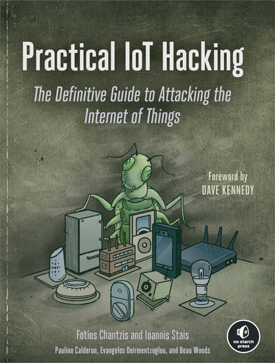

# Practical_IoT_Hacking
As I am going through this book, I wanted a place to document my progress. This repository contains custom GNS3 labs to apply the material covered in the book "Practical IoT Hacking" by Fotios Chantzis, Ioannis Stais, and Paulino Calderon.

